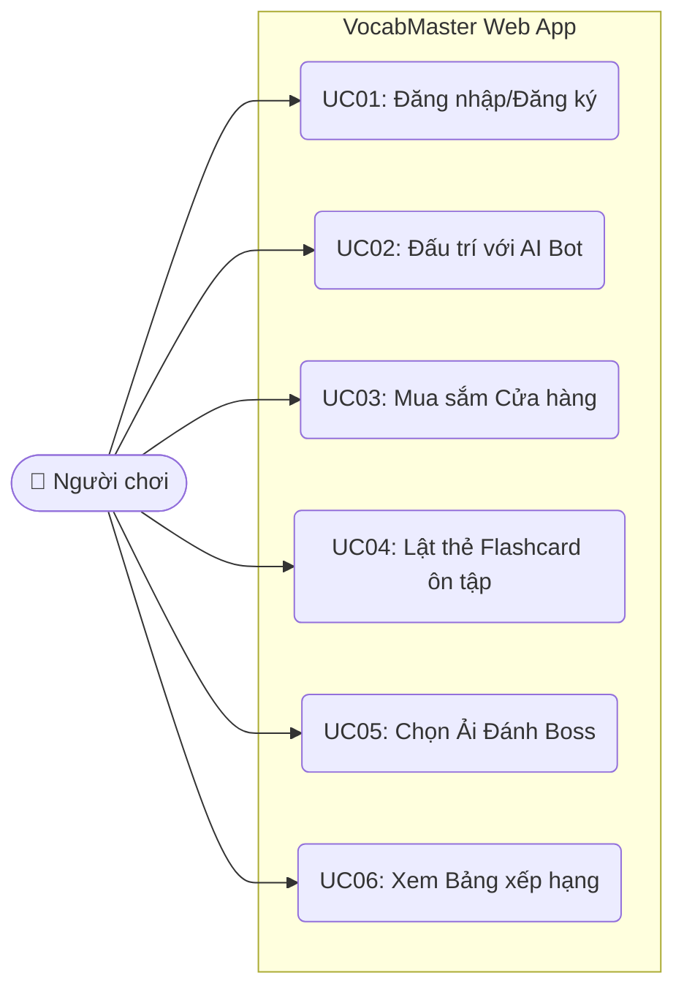
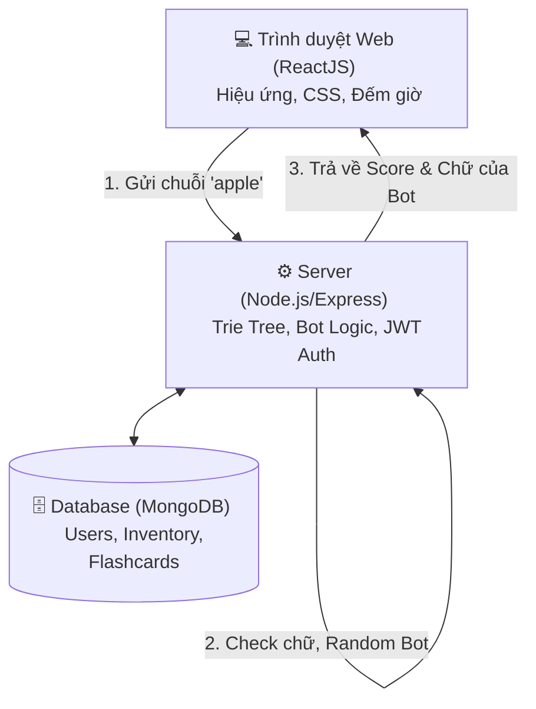
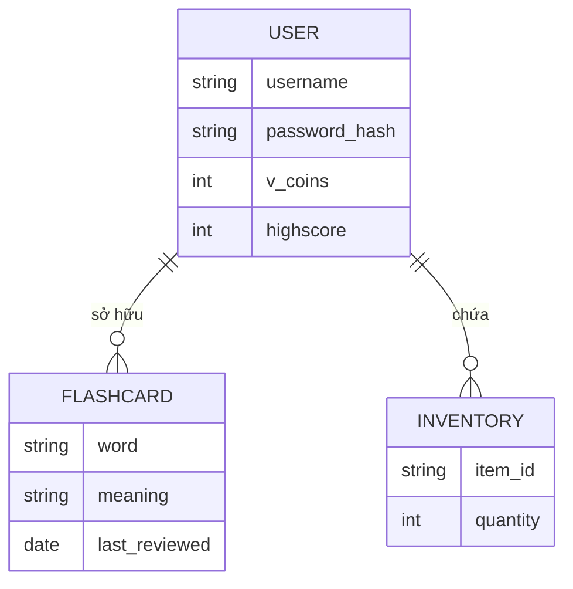

# 🌍 Báo cáo Đồ án: VocabMaster - Nền tảng rèn luyện từ vựng tiếng Anh (Web Fullstack)

## 1. Tổng quan dự án (Project Overview)
- **Tên dự án chính thức:** VocabMaster: Nền tảng rèn luyện từ vựng tiếng Anh
- **Nền tảng:** Ứng dụng Web (Web Application).
- **Kiến trúc:** Client-Server (Monorepo).
- **Công nghệ cốt lõi:** 
  - *Frontend:* React (Vite) + Vanilla CSS (Aesthetics cao cấp).
  - *Backend:* Node.js (Express) tích hợp thuật toán AI Cây Trie.
  - *Database:* MongoDB.
- **Quy mô nhóm:** 5 thành viên.

> [!TIP]
> **SỰ TRỞ LẠI CỦA CÁC TÍNH NĂNG KHỦNG:** Việc chuyển sang nền tảng Web cho phép chúng ta vẽ giao diện siêu nhanh và đẹp. Do đó, các tính năng "Ăn điểm tuyệt đối" như Cửa hàng, Sổ tay Flashcard, Hệ thống Boss đã chính thức được khôi phục. Đồ án giờ đây là một sản phẩm thương mại thực thụ.

---

## 2. Kiến trúc Thư mục Monorepo (Client & Server)
Dự án được chia làm 2 phần độc lập nằm chung trong 1 kho chứa (Repository):
```text
VocabMaster_Web/
│
├── 📁 client/                     # FRONTEND (Giao diện React)
│   ├── index.css                # CSS Hệ thống (Glassmorphism, Animations)
│   ├── src/
│   │   ├── components/          # Thẻ Flashcard, Nút bấm, Thanh máu
│   │   ├── pages/               # Màn hình (Game, Shop, Dashboard)
│   │   └── services/            # File gọi API (Fetch/Axios)
│
└── 📁 server/                     # BACKEND (Xử lý Logic & AI)
    ├── src/
    │   ├── controllers/         # Nhận Request từ Frontend
    │   ├── models/              # Schema MongoDB (User, Item)
    │   ├── ai/                  # Thuật toán Trie Tree & Bot Logic
    │   └── data/                # Chứa file từ điển chuẩn JSON
    └── .env                     # Chứa chuỗi kết nối Database
```

---

## 3. Hệ sinh thái Tính năng (Feature Ecosystem)

### 3.1. Lõi Gameplay (Core)
- Nối từ với AI Bot. Điểm số tính theo độ dài từ và thời gian Combo.
- Mọi logic kiểm tra từ và AI Suy nghĩ được thực hiện trên **Backend**. Frontend chỉ làm nhiệm vụ vẽ hiệu ứng và bấm giờ đếm ngược.

### 3.2. Hệ thống Tiền tệ & Cửa hàng (Economy & Store)
- Đánh thắng Bot hoặc nhận Combo sẽ rớt ra **V-Coins**.
- Dùng V-Coins vào Cửa hàng để mua:
  - *Avatar VIP:* Đổi ảnh đại diện xịn.
  - *Vật phẩm (Boosters):* Mua "Kính lúp" (Nhờ hệ thống gợi ý từ khi bị bí).

### 3.3. Sổ tay Flashcard (Giáo dục sâu)
- Các từ mà người chơi bị Bot đánh bại sẽ tự động được lưu vào **Danh sách Cần ôn tập**.
- Người chơi có thể vào mục Flashcard để lật thẻ 3D, học lại các từ này cùng nghĩa tiếng Việt và ví dụ.

### 3.4. Chế độ Chiến dịch (Boss Campaign)
- Một bản đồ các "Trùm" (Boss) từ dễ đến khó (Ví dụ: Thung lũng A, Hang động B).
- Mỗi Boss có một luật lệ riêng: Boss 1 chỉ cho 10 giây suy nghĩ. Boss 2 cấm dùng chữ E.

---

## 4. Đặc tả Yêu cầu Hệ thống (System Requirements - SRS)

### 4.1. UC01: Đăng nhập & Đăng ký
- Màn hình Auth tuyệt đẹp với hiệu ứng kính mờ (Glassmorphism). Người chơi tạo tài khoản, thông tin được lưu an toàn vào MongoDB.

### 4.2. UC02: Đấu Trí & Giao tiếp API
- **Client:** Người chơi gõ chữ `APPLE`, nhấn Enter. Hiệu ứng đạn bắn lên màn hình. Client gọi API `POST /api/game/submit`.
- **Server:** Node.js nhận chữ. Tra Cây Trie trên RAM Server. Check HashSet. Gọi Bot DFS tìm từ trả đũa. Trả về kết quả JSON cho Client.
- **Client:** Nhận kết quả. Nếu Đúng -> Cập nhật máu Boss, hiện chữ của Bot. Nếu Sai -> Rung màn hình, báo viền Đỏ.

### 4.3. UC03: Mua sắm Cửa hàng
- Mở danh sách các thẻ Vật phẩm (vẽ bằng Grid CSS). Bấm Mua -> Gọi API trừ tiền V-Coins trong Database -> Mở khóa vật phẩm.

### 4.4. UC04: Ôn tập Flashcard
- Trang Thư viện chứa các thẻ từ vựng. Khi rê chuột (Hover), thẻ sẽ lật 180 độ bằng hiệu ứng CSS 3D Transforms để hiển thị nghĩa ở mặt sau.

---

## 5. Mổ xẻ Kiến trúc & Sơ đồ Hệ thống (UML)

### 5.1. Sơ đồ Chức năng (Use Case Diagram)
Đã khôi phục toàn bộ siêu tính năng.


### 5.2. Sơ đồ Kiến trúc Mạng (Architecture Diagram)
Tách bạch rạch ròi 3 tầng.


### 5.3. Thiết kế Cấu trúc Dữ liệu (MongoDB ERD)
Không dùng JSON tĩnh nữa, chúng ta dùng Database xịn.


---

## 6. Thiết kế Giao diện & Trải nghiệm (UI/UX Aesthetics)
Để ứng dụng đạt điểm A+, giao diện **bắt buộc phải gây ấn tượng mạnh (WOW effect)**:
- **Glassmorphism:** Các bảng điều khiển và Card phải làm mờ hậu cảnh (thuộc tính CSS `backdrop-filter: blur(10px)`), viền trắng trong suốt.
- **Bảng màu:** Dùng Dark Mode (Nền xanh đen vũ trụ), chữ trắng, điểm xuyết bằng các Gradient rực rỡ (Tím Neon, Xanh Cyan) cho các nút bấm quan trọng.
- **Micro-Animations:** Mọi nút bấm khi đưa chuột vào phải phóng to nhẹ (`transform: scale(1.05)`). Khung chat chữ phải trượt mượt mà lên trên.

---

## 7. Bảng Phân chia Nhiệm vụ (Cân bằng & Chuyên nghiệp)

| Thành viên | Vai trò | Trách nhiệm cốt lõi |
| :--- | :--- | :--- |
| **TV 1** | **Backend Engineer (AI)** | Xây dựng Server Express. Chuyển thể thuật toán Cây Trie từ C++ sang JavaScript. Viết logic Bot DFS. Cung cấp API `/api/game/submit`. |
| **TV 2** | **Backend Engineer (DB)** | Thiết kế Schema MongoDB bằng Mongoose. Viết API Đăng nhập/Đăng ký (JWT Auth). Viết API xử lý mua bán trừ tiền V-Coins. |
| **TV 3** | **Frontend (Pages)** | Cài đặt Vite + React. Lắp ráp các màn hình chức năng: Màn hình Login, Cửa hàng (Store), Thư viện Flashcard lật 3D. Liên kết gọi API từ TV2. |
| **TV 4** | **Frontend (Game Loop)** | Chuyên gia xử lý màn hình Trận chiến. Làm thanh đếm lùi 15s. Xử lý logic gõ phím. Bắn pháo hoa (Confetti) khi thắng. Chèn âm thanh HTML5 Audio. |
| **TV 5** | **UI/UX Designer & DevOps** | Thầu toàn bộ file `index.css`. Thiết kế bảng màu và Glassmorphism cho cả đội dùng. Triển khai (Deploy) Frontend lên Vercel và Backend lên Render để lấy Link thật nộp bài. |

---

## 8. Kế hoạch Kiểm thử (QA) & Bảo vệ Đồ án
1. **Kiểm thử Tải (Load Testing):** Đảm bảo Backend Node.js load mảng 100k từ vào RAM không bị crash (Dùng Streams thay vì `fs.readFileSync` để tối ưu nếu cần).
2. **Kiểm thử Bảo mật (Security):** Phải mã hóa Mật khẩu người dùng bằng `Bcrypt` trước khi lưu vào MongoDB.
3. **Phòng hờ sập mạng:** Nếu lúc thuyết trình mất mạng Internet, Client phải có màn hình chờ báo lỗi "Mất kết nối đến Server" thật đẹp thay vì màn hình trắng tinh.
